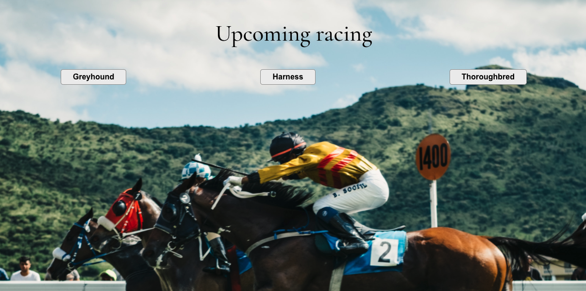

# Bet Right Racing Task
This project was created with Create React App.

## Introduction
This project aims to provide upcoming racing races to users. And there will be three categories
including Greyhound, Harness and Thoroughbred. When user clicked button listed on the page, they
can see that every racing card is presented in front of them. They can easily know the Venue name,
Race Number and Start Time of the race. Users can navigate to different categories through clicking
the button.

### `npm start`

Runs the app in the development mode.\
Open [http://localhost:3000](http://localhost:3000) to view it in your browser.

The page will reload when you make changes.\
You may also see any lint errors in the console.

