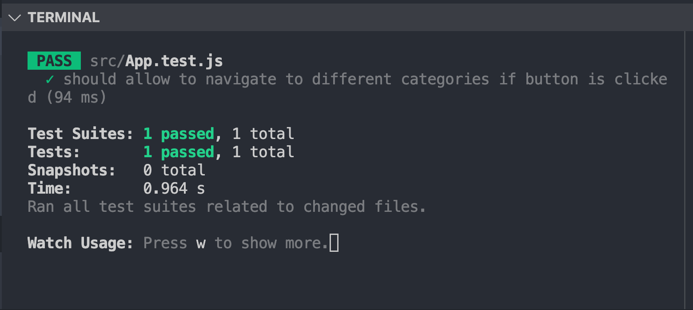

# Bet Right Racing Task
This project was created with Create React App.

## Introduction
This project aims to provide upcoming racing races to users. And there are three categories
including Greyhound, Harness and Thoroughbred. When user clicked button listed on the page, they
can see that every racing card is presented in front of them. They can easily know the Venue name,
Race Number and Start Time of the race. Users can navigate to different categories through clicking
the different category's button.

## Context
According to the instruction, the key request of this project is to fetch the upcoming racing data of three different categories through GET request from given API address and also outline the three key information: Venue Name, Race Number and Start Time.

The front-end framework for this project is React.js and also included React hooks as it is more advanced and the performance is better. In terms of fetching data, I choose Axios because it provides an easy-to-use API in a compact package for most of HTTP communication needs.

Only being able to show the upcoming racing details is not attractive enough, so I choose styled-component to styling the component because it is more in line with React component-based development. And I also create subtitle for users to easily find out the category they selected when they view the upcoming racing.

## Testing

### Test Cases

- Should allow to navigate to Greyhound category when user clicked greyhound button
- Should allow to navigate to Harness category when user clicked harness button
- Should allow to navigate to Thoroughbred category when user clicked thoroughbred button

## Prerequisites

- npm

## Installation

`npm install` - Install dependenies  
`npm start` - Run application  
`npm run test` - Run testing

## Contact

Sophie Sun - Sophiesun.au@gmail.com

